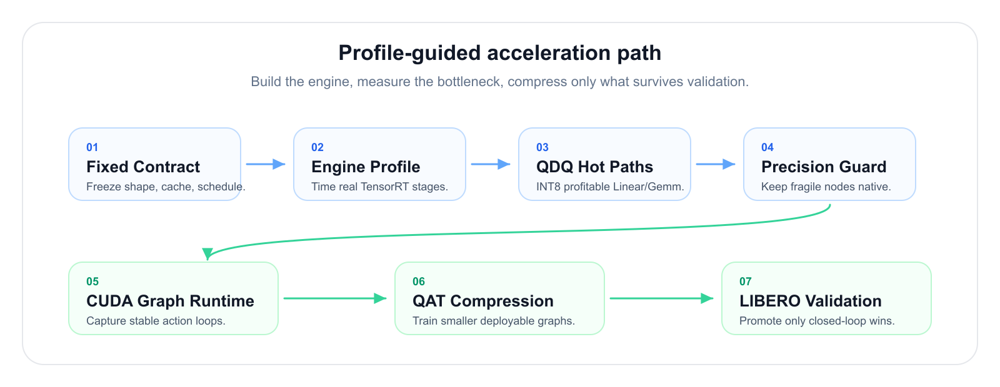
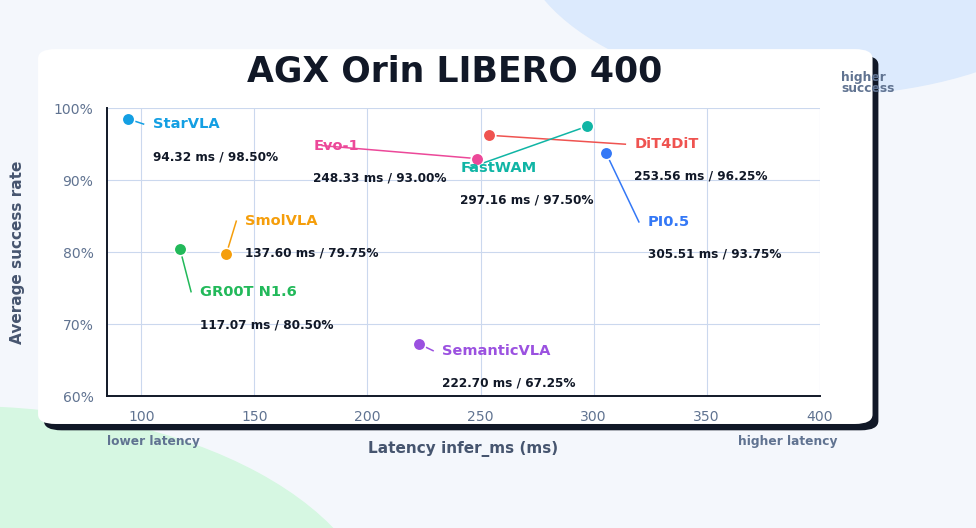
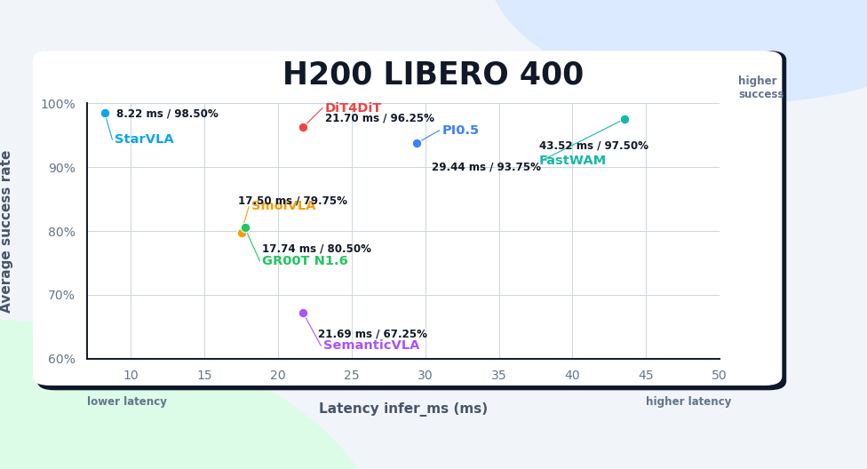
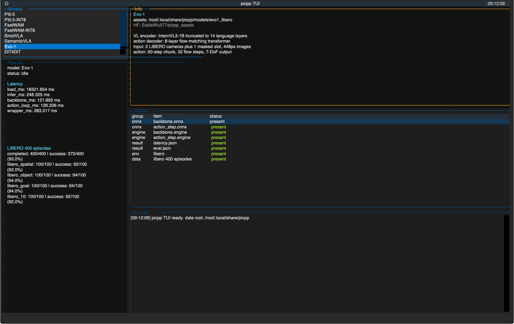

<h1 align="center">pi.cpp</h1>

<p align="center">
  <b>TensorRT-first VLA/WAM inference on edge GPUs.</b>
</p>

<p align="center">
  
  
  
  
  
</p>

Inspired by llama.cpp, pi.cpp brings optimized deployment of robot foundation
models to edge devices, workstations, and embedded platforms.

pi.cpp turns each policy into a fixed TensorRT engine package plus a compact
C++ runtime path. The same workflow handles latency profiling, model-specific
QDQ-INT8 recipes, CUDA Graph loops, and closed-loop LIBERO validation.

```text
checkpoint -> ONNX contract -> TensorRT engines -> C++ runtime -> policy server
          -> latency profile -> closed-loop LIBERO validation
```

## Why pi.cpp

| Design choice | What it unlocks |
| --- | --- |
| TensorRT-first runtime | Local `.engine` packages, no graph interpretation at request time. |
| Model-specific contracts | Each policy keeps the tensor layout that makes it fast. |
| Profile-guided INT8 | QDQ only where real AGX profiles show a win. |
| Runtime scheduling | Stable buffers, direct cache handoff, and CUDA Graph action loops. |
| Closed-loop truth | Latency claims stay tied to shape, finite output, and LIBERO gates. |

## Acceleration Stack

Each acceleration route moves through the same gates:

<p align="center">
  
</p>

| Layer | Work done in pi.cpp | Promotion gate |
| --- | --- | --- |
| Baseline | ✅ Fixed ONNX contract and local TensorRT engines. | Shape, finite output, stage latency. |
| Profile | ✅ Find hot TensorRT layers on the real device. | AGX/H200 timing, not node-count guesses. |
| QDQ | ✅ Quantize profitable fixed-weight Linear/Gemm paths. | Full runtime improves. |
| Guard | ✅ Roll sensitive attention, VAE, norm, cast, or boundary nodes back to native precision. | Drift and smoke tests stay acceptable. |
| Runtime | ✅ Reuse buffers/bindings and capture stable loops with CUDA Graph. | Same-input parity, then steady-state speed. |
| QAT | ✅ Train deployable reductions such as fewer denoise steps or FFN pruning. | Faster engine plus recovered success. |

## Model Zoo

**Models**

-  [PI0.5](https://huggingface.co/lerobot/pi05-libero) - PaliGemma-based flow-matching policy for LIBERO deployment.
-  [FastWAM](https://github.com/yuantianyuan01/FastWAM) - video-world-model policy with cached language context and action decoding.
-  [SmolVLA](https://huggingface.co/blog/smolvla) - compact LeRobot VLA based on SmolVLM.
-  [SemanticVLA](https://github.com/iLearn-Lab/AAAI26-SemanticVLA) - SemanticVLA-derived LIBERO runtime using a Qwen VLM backbone.
-  [Evo-1](https://github.com/MINT-SJTU/Evo-1) - InternVL3-1B policy with a compact flow-matching action transformer.
-  [DiT4DiT](https://dit4dit.github.io/) - video Diffusion Transformer features paired with an action diffusion head.
-  [GR00T N1.6](https://github.com/NVIDIA/Isaac-GR00T) - NVIDIA GR00T policy with TensorRT backbone and action-loop runtime.
-  [StarVLA](https://github.com/starVLA/starVLA) - Qwen3-VL-OFT LIBERO policy with a continuous action head and cached prompt contract.

**Platforms**

-  NVIDIA Jetson AGX Orin - edge deployment target and compatibility gate.
-  NVIDIA H200 - export, build, and large-memory debugging environment.

On the way:

-  [LingBot-VLA](https://github.com/Robbyant/lingbot-vla) - integration is kept on a separate branch while TensorRT parity and portable assets are repaired.

## Benchmarks

pi.cpp tracks two deployment modes:

| Mode | Goal | Validation |
| --- | --- | --- |
| Accuracy-aligned deployment | Keep TensorRT deployment close to the official or float policy. | Closed-loop LIBERO, parity checks, stable model contracts, and the default engine build path. |
| Profile-guided AGX acceleration | Minimize runtime latency on NVIDIA Jetson AGX Orin using QDQ-INT8, structural graph changes, and runtime scheduling. | `picpp latency`, valid output shape, finite outputs, same-input drift where available, and closed-loop success when the route is presented as success-preserving. |

### LIBERO 400 Scale

AGX Orin:



H200:



### Models

Latency values come from `picpp latency` on locally built engines, with the
matching model assets and prompt cache used for closed-loop evaluation. Success
rates are closed-loop LIBERO 400 episode results.

| Model | Runtime stages | AGX Orin infer_ms | H200 infer_ms | LIBERO 400 success |
| --- | --- | ---: | ---: | ---: |
| PI0.5 | prefix_embed + prefix_lm + suffix_step | 305.51 ms | 29.44 ms | 93.75% |
| FastWAM | vae_image_encoder + video_prefill + action_step_dynamic_kv | 297.16 ms | 43.52 ms | 97.50% |
| SmolVLA | prefix_embed + prefix_lm + suffix_loop | 137.60 ms | 17.50 ms | 79.75% |
| SemanticVLA | backbone + action_step | 222.70 ms | 21.69 ms | 67.25% |
| Evo-1 | backbone + action_step | 248.33 ms | - | 93.00% |
| DiT4DiT | cosmos_vae_encode + cosmos_feature + action_loop official4 | 253.56 ms | 21.70 ms | 96.25% |
| GR00T N1.6 | backbone + action_loop | 117.07 ms | 17.74 ms | 80.50% |
| StarVLA | policy | 94.32 ms | 8.22 ms | 98.50% |

Evo-1 TensorRT reproduced the official floating-point policy within two
episodes: `372/400` versus `374/400` on the same LIBERO protocol.

### AGX Orin Acceleration Results

These rows show the current evidence-backed acceleration routes. Closed-loop
success is listed only when the full LIBERO 400 result is part of the claim.

Platform: NVIDIA Jetson AGX Orin, TensorRT 10.3.0, CUDA 12.6 driver stack.
Metric: `picpp latency` `infer_ms`, warmup 10 iterations, measured 10
iterations.

| Model | Acceleration route | AGX result | Validation |
| --- | --- | --- | --- |
| PI0.5 | Profile-guided QDQ-INT8 on fixed-weight Linear/Gemm plus suffix broadcast-KV. | `305.51 -> 125.99 ms` | Output `[10,7]`, finite. |
| FastWAM | Selective QDQ-INT8, FP16 precision guard, CUDA Graph action loop, and QAT graph reduction. | `297.16 -> 161.88 ms` | LIBERO `379/400 = 94.75%`; [details](docs/fastwam-detail.md). |

### Profile-Guided QDQ-INT8

pi.cpp does not treat INT8 as a global switch. The deployable recipe is:
profile the TensorRT engines, quantize only the profitable fixed-weight
Linear/Gemm islands, roll sensitive nodes back to native precision, then
validate with the same runtime path used by the robot policy.

| Promote to INT8 when measured | Keep native unless a targeted profile wins |
| --- | --- |
| MLP/FFN Linear or Gemm nodes with constant weights. | Attention QK/PV MatMul, Softmax, and LayerNorm. |
| Attention projection Linear/Gemm nodes such as q/k/v/o projections. | VAE/Conv-heavy paths and residual vision blocks. |
| Repeated suffix/action Linear/Gemm work where loop count amplifies the gain. | Shape, cast, transpose, scheduler, and cache bookkeeping. |
| Stable QDQ islands that pass finite output and same-input drift gates. | Sensitive action boundary nodes such as time embedding, action encoder, and head when they do not produce stable latency wins. |

Rejected routes are kept in the experiment ledger because they matter. Dynamic
attention QDQ, broad VAE QDQ, and FFN plugins have all looked attractive in
isolation but failed to beat TensorRT native paths in full AGX runtime. The
rule is simple: INT8 is a hypothesis, not a conclusion.

## Getting Started

Choose the setup path that matches your environment. Docker and pip/uv expose
the same `picpp` and `picpp-tui` commands.

| Method | Install path | Notes |
| --- | --- | --- |
| Docker | Prebuilt pi.cpp environment with TensorRT, LIBERO, TUI, and CLI. | NVIDIA GPU platforms with x86_64 or arm64 TensorRT stacks. Validated on H200 and AGX Orin. |
| Pip and uv | Editable Python install into your own CUDA/TensorRT environment. | Useful when changing Python or C++ runtime code. |

For remote policy serving or scripted closed-loop eval, start `picpp server`,
then run `picpp client` from the robot or simulator side.

For local development:

```bash
git clone https://github.com/DiscoverRobotics/pi.cpp.git && cd pi.cpp
uv venv --python 3.10 .venv
source .venv/bin/activate
uv pip install -e ".[libero]"
```

### TUI

The easiest way to get started is to launch the pi.cpp TUI using Docker:

```bash
docker run --rm --gpus all -it -v ~/.local/share:/root/.local/share uniflexai/picpp:latest
```

For NVIDIA Jetson devices such as AGX Orin:

```bash
docker run --rm --runtime nvidia -it -v ~/.local/share:/root/.local/share uniflexai/picpp:latest
```

Inside the TUI:

```text
d Download  -> fetch model assets and prepare managed LIBERO runtime data
b Build     -> build TensorRT engines for the selected model
l Latency   -> run picpp latency and write latency.json
e Eval      -> run closed-loop LIBERO evaluation through picpp server/client
s Stop      -> stop the current process
q Quit      -> exit
```



### CLI

pi.cpp also provides direct commands for scripted validation.

#### picpp latency

Measure end-to-end runtime latency and save `<model_dir>/latency.json`:

```bash
picpp latency --model fastwam --model-dir assets/fastwam_libero
```

#### picpp eval

Evaluate optimized models against LeRobot action traces:

```bash
picpp eval --model fastwam --dataset lerobot/libero --model-dir assets/fastwam_libero
```

Estimate full LIBERO eval wall time inside the Docker image:

```bash
python scripts/estimate_libero_eval_time.py fastwam
```

The script reads the latest `picpp latency` profile, samples LIBERO render
timing, and prints a coarse closed-loop eval wall-time estimate.

#### picpp server

Run a websocket inference server:

```bash
picpp server --model fastwam --model-dir assets/fastwam_libero --host 0.0.0.0 --port 8000
```

#### picpp client

Run closed-loop LIBERO evaluation against a running pi.cpp server:

```bash
picpp client --host 127.0.0.1 --port 8000
```

By default the client replans only when the current action chunk is exhausted.
For a lightweight async supervision path, let the client monitor recent
end-effector motion while actions are executing. If the monitor detects a
stuck rollout, it stops the remaining chunk and replans from the current
observation:

```bash
picpp client --host 127.0.0.1 --port 8000 --async-supervision
```

## Runtime Flow

```text
portable ONNX assets
        |
        v
local TensorRT engines
        |
        v
runner wrapper -> picpp latency
        |
        +-> picpp server <- picpp client <- LIBERO closed-loop simulator
        |
        +-> picpp eval   <- LeRobot offline action traces
```

The runtime keeps model-specific contracts explicit: image layouts, state
normalization, prompt caches, scheduler constants, action denormalization, and
server policy behavior live next to the model runner that needs them.

## License

MIT License
